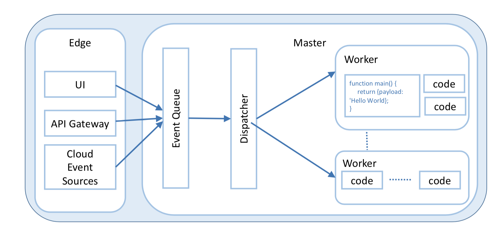
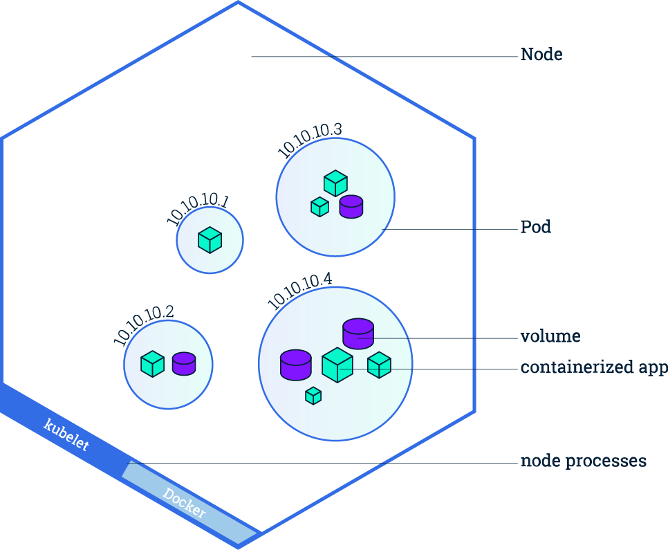
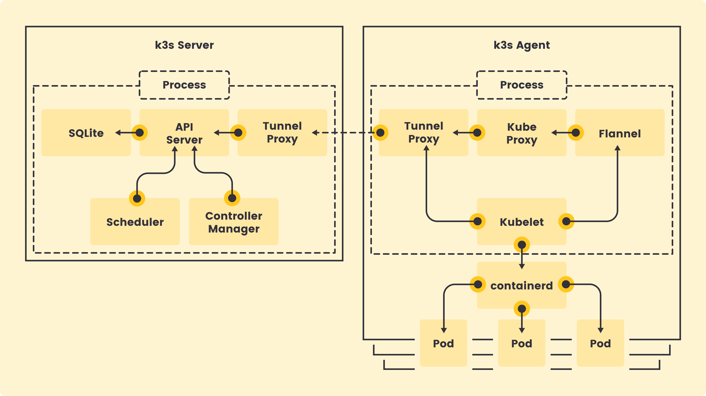

% FaaS - Function as a Service
% John Sanabria - john.sanabria@correounivalle.edu.co
% 2020-05-27

# Introducción {#introduccion}

 * Continuos desarrollos diferentes escenarios: mainframes, transistores → computadoras personales, Internet, web services, virtualización (hypervisor → basada en el sistema operativo), computación en la nube.

* Computación en la nube: IaaS, PaaS, SaaS. 

* IaaS permite compra de servidores disponibles en Internet y se paga por lo que se consume. Sin embargo, demanda que los servidores estén siempre arriba independiente si estos son accedidos o no.

* FaaS (Function as a Service ) permite la ejecución de funciones en la nube y se paga solo por el tiempo de ejecución de estas funciones

* **PROBLEMA** estas funciones no se pueden tomar más de 12 minutos en ejecución  y la cantidad de RAM que consumen es limitada.

# Serverless 

* *Serverless* hace referencia a un tipo de computación donde el usuario no tiene cuidado del servidor donde correrá sus procesos

{width=70%}

# FaaS

* FaaS (*Function as a Service*) es un tipo de *serverless* donde las funciones definidas por el desarrollador corren en contenedores

{width=70%}

# OpenFaaS

* OpenFaaS es una implementación del concepto de FaaS que permite ejecutar funciones como servicios en diferentes entornos.

{width=50%}

# Kubernetes

{width=50%}

# Algunos objetos en Kubernetes

{width=50%}

Veamos este ejemplo - [<a href="https://www.josedomingo.org/pledin/2018/06/recursos-de-kubernetes-pods/" target="_blank">enlace</a>]

# Ingress extensions

{width=50%}

Veamos este ejemplo - [<a href="https://matthewpalmer.net/kubernetes-app-developer/articles/kubernetes-ingress-guide-nginx-example.html" target="_blank">enlace</a>]

# k3s

{width=50%}

# Aplicación de Docker Compose → Kubernetes

