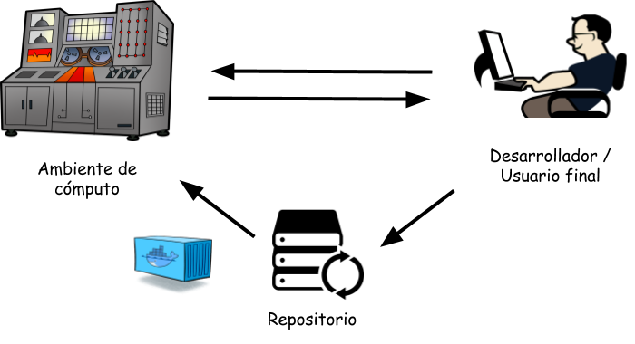
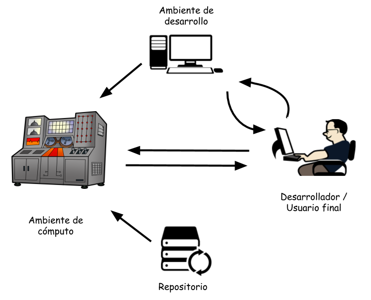

% FaaS - Function as a Service
% John Sanabria - john.sanabria@correounivalle.edu.co
% 2020-05-27

# Introducción {#introduccion}

 * Continuos desarrollos diferentes escenarios: mainframes, transistores → computadoras personales, Internet, web services, virtualización (hypervisor → basada en el sistema operativo), computación en la nube.

* Computación en la nube: IaaS, PaaS, SaaS. 

* IaaS permite compra de servidores disponibles en Internet y se paga por lo que se consume. Sin embargo, demanda que los servidores estén siempre arriba independiente si estos son accedidos o no.

* FaaS (Function as a Service ) permite la ejecución de funciones en la nube y se paga solo por el tiempo de ejecución de estas funciones

* **PROBLEMA** estas funciones no se pueden tomar más de 12 minutos en ejecución  y la cantidad de RAM que consumen es limitada.

# Agenda

* Serverless

* FaaS - Function as a Service

* OpenFaaS - una implementación de FaaS

* Kubernetes

* k3s - k8s para IoT

* Aplicación de Docker Compose → Kubernetes

# Serverless 

* *Serverless* hace referencia a un tipo de computación donde el usuario no tiene cuidado del servidor donde correrán sus procesos

<center>
{width=70%}
</center>

# Agenda

* ~~Serverless~~

* FaaS - Function as a Service

* OpenFaaS - una implementación de FaaS

* Kubernetes

* k3s - k8s para IoT

* Aplicación de Docker Compose → Kubernetes

# FaaS - Function as a Service

* FaaS (*Function as a Service*) es un tipo de *serverless* donde las funciones definidas por el desarrollador corren en contenedores

* FaaS es una computación orientada a eventos. 

  * Chatbots
  * Producción de *thumbnail* 
  * Análisis en tiempo real de datos
  * Recomandaciones e-commerce

* FaaS para HPC

  * Apoyo a recolección de datos generados por sistemas IoT
  * Monitoreo de cargas de trabajo en almacenamiento para sistemas HPC

# FaaS - Una arquitectura en caricatura

\ 

&nbsp;

<center>
{width=70%}
</center>

# Agenda

* ~~Serverless~~

* ~~FaaS - Function as a Service~~

* OpenFaaS - una implementación de FaaS

* Kubernetes

* k3s - k8s para IoT

* Aplicación de Docker Compose → Kubernetes


# OpenFaaS

* OpenFaaS es una implementación del concepto de FaaS que permite ejecutar funciones como servicios en diferentes entornos, *bare metal* y orquestadores de contenedores.

<center>
{width=50%}
</center>

# Ejemplos con OpenFaaS

* OpenFaaS y funciones ya definidas - [enlace](https://github.com/josanabr/LibroFaaS/tree/master/code/examples/openfaas)

* Texto guía, sección 4.2.

# ¿Cómo será verlo operar en k8s? ¿Qué es k8s? ¿Cómo se interactúa con un ambiente de k8s?

\ 


<center>
{width=30%}
</center>

# Agenda

* ~~Serverless~~

* ~~FaaS - Function as a Service~~

* ~~OpenFaaS - una implementación de FaaS~~ 

* Kubernetes

* k3s - k8s para IoT

* Aplicación de Docker Compose → Kubernetes


# Kubernetes - un orquestador de contenedores

* Kubernetes es un proyecto creado por Google y liberado en el 2014
* Kubernetes tiene una alta influencia del mundo del desarrollo de software
* Kubernetes ex

# Algunos objetos en Kubernetes

* *Pod* es la unidad básica de ejecución en k8s. Un *pod* ejecuta contenedores.

* *Service* es un objeto que permite exponer un servicio que corre en un *pod* afuera de este. Ejemplo de objetos que se apoyan en *Service*: *NodePort*, *LoadBalancer* e *Ingress*.

* Los objetos generalmente se definen en un archivo YAML.

<center>
{width=35%}
</center>

Veamos este ejemplo - [<a href="https://www.josedomingo.org/pledin/2018/06/recursos-de-kubernetes-pods/" target="_blank">enlace</a>]


# Accediendo a un servicio en Kubernetes 

* Un *Service* es un objeto que permite exponer un servicio que corre en un contenedor afuera de él.

* *ClusterIP* es el servicio por defecto que permite que un servicio en un *Pod* se pueda acceder desde **dentro del cluster** - [enlace](https://medium.com/google-cloud/kubernetes-nodeport-vs-loadbalancer-vs-ingress-when-should-i-use-what-922f010849e0).

* Existen diversos objetos que pueden exponer dicho *service* a usuarios externos: *NodePort*, *LoadBalancer* o  *Ingress*.


#  NodePort
* *NodePort* es un objeto de k8s quien recibe un número de puerto y lo toma en todos los nodos del cluster. Cada vez que se haga una petición a cualquier IP de los nodos del cluster a ese puerto lo redirige al *Service*

<center>
{width=35%}
</center>

# Definición de un NodePort

```
apiVersion: v1
kind: Service
metadata:  
  name: my-nodeport-service
spec:
  selector:    
    app: my-app
  type: NodePort
  ports:  
  - name: http
    port: 80
    targetPort: 80
    nodePort: 30036
    protocol: TCP
```

# LoadBalancer

* El esquema de *LoadBalancer* es la forma estándar de exponer un servicio en Internet.

* En este esquema no hay filtros, no hay enrutamientos; permite el envio de casi cualquier tipo de tráfico HTTP, TCP, UDP, WebSockets, gRPC.

* Cada *Service* expuesto demanda un IP, es costoso

<center>
{width=35%}
</center>

# Ingress 

* *Ingress* es un objeto que permite exponer un servicio de red apoyado a través de un *proxy* inverso, ejemplo: Nginx.

* *Ingress* es una especie de "smart router". Por defecto es capaz de redireccionar tráfico HTTP

* Existen diferentes controladores de tipo *Ingress*: Nginx, Contour, Istio

* Funciona bien cuando se quieren exponer varios servicios bajo un mismo IP

<center>
{width=40%}
</center>

Veamos este ejemplo - [<a href="https://matthewpalmer.net/kubernetes-app-developer/articles/kubernetes-ingress-guide-nginx-example.html" target="_blank">enlace</a>]

# Agenda

* ~~Serverless~~

* ~~FaaS - Function as a Service~~

* ~~OpenFaaS - una implementación de FaaS~~ 

* ~~Kubernetes~~

* k3s - k8s para IoT

* Aplicación de Docker Compose → Kubernetes


# k3s

* Kubernetes es un producto de software complejo que gestiona una infraestructura compleja

* Kubernetes tiene muchos componentes en su interior que necesitan ser cuidadosamente configurados

* Existen variaciones que facilitan la interacción con ambientes k8s: minikube, docker desktop, k3s

<center>
{width=50%}
</center>

# Agenda

* ~~Serverless~~

* ~~FaaS - Function as a Service~~

* ~~OpenFaaS - una implementación de FaaS~~ 

* ~~Kubernetes~~

* ~~k3s - k8s para IoT~~ 

* Aplicación de Docker Compose → Kubernetes

# Aplicación de Docker Compose → Kubernetes

* Visitemos el demo [Get started with Docker Compose](https://docs.docker.com/compose/gettingstarted/)

* La versión en k8s - [enlace](https://github.com/josanabr/LibroFaaS/tree/master/code/k8s/flaskredisapp)

# OpenFaaS + k8s

Sección 5.6 del texto guía.
